# 1. Project Title and Objective

## Project Title

**Automating CI/CD Pipelines Using AWS Lambda**

## Objective

The objective of this project is to implement an automated, event-driven CI/CD pipeline using AWS services.

The project automatically deploys a static web application whenever changes are pushed to a GitHub repository. After a successful deployment through AWS CodePipeline, Amazon EventBridge detects the successful pipeline event and triggers an AWS Lambda function to perform deployment automation.

This project demonstrates how AWS Lambda, CodePipeline, EventBridge, Amazon S3, IAM, and CloudWatch can be integrated to create a serverless CI/CD workflow.

---

# 2. AWS Services Used

| Service | Purpose |
| --- | --- |
| **AWS CodePipeline** | Automates the source and deployment workflow |
| **Amazon S3** | Stores the deployed static web application |
| **AWS Lambda** | Executes deployment automation after a successful pipeline |
| **Amazon EventBridge** | Detects and routes successful CodePipeline events |
| **Amazon CloudWatch** | Stores and monitors Lambda execution logs |
| **AWS IAM** | Provides secure permissions to AWS services |
| **AWS CodeConnections** | Connects the GitHub repository to CodePipeline |

### External Service

| Service | Purpose |
| --- | --- |
| **GitHub** | Stores the application source code |

---

# 3. Architecture / Workflow

## Architecture

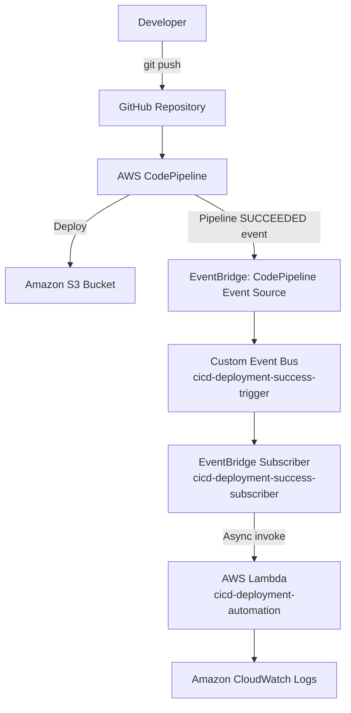

## Workflow

1. The developer pushes changes to the GitHub `main` branch.
2. AWS CodePipeline detects the source-code change.
3. CodePipeline retrieves the latest code from GitHub.
4. CodePipeline deploys the application files to Amazon S3.
5. After successful deployment, CodePipeline generates a `SUCCEEDED` pipeline event.
6. Amazon EventBridge receives the CodePipeline event.
7. The CodePipeline event source filters successful executions of the configured pipeline.
8. The matching event is forwarded to the custom EventBridge event bus.
9. The EventBridge subscriber receives the event.
10. The subscriber asynchronously invokes the `cicd-deployment-automation` Lambda function.
11. Lambda verifies the deployment bucket and records the deployment details.
12. Amazon CloudWatch stores the Lambda execution logs.

---

# 4. Implementation Steps

## Step 1: Create the Sample Web Application

A simple static web application was created using HTML, CSS, and JavaScript.

```text
ci-cd-lambda-project/
├── index.html
├── style.css
└── app.js
```

The application contains an HTML interface, CSS styling, JavaScript functionality, and a **Test Application** button for verifying the application. The final version contains:

```html
<h1>AWS CI/CD Pipeline Demo - Final Version</h1>
```

## Step 2: Create the GitHub Repository

| Setting | Value |
| --- | --- |
| Repository | `aws-cicd-lambda-project` |
| Branch | `main` |

The GitHub repository is the source provider for AWS CodePipeline.

## Step 3: Create the Amazon S3 Deployment Bucket

| Setting | Value |
| --- | --- |
| Bucket | `aws-lambda-cicd-demo-project-2026` |
| Region | `ap-south-1` |

CodePipeline automatically deploys the application files to this bucket.

## Step 4: Configure IAM Roles

**CodePipeline role:** `AWSCodePipelineServiceRole-CICDDemo`

Provides permissions for GitHub CodeConnections, CodePipeline, S3 artifact storage, and S3 deployment.

**Lambda role:** `AWSLambdaCICDAutomationRole`

Provides permissions for Lambda execution, CloudWatch logging, and verifying the deployment S3 bucket.

## Step 5: Create AWS CodePipeline

Pipeline name: `aws-lambda-cicd-demo-pipeline`

| Stage | Provider | Configuration |
| --- | --- | --- |
| Source | GitHub | Branch: `main` |
| Deploy | Amazon S3 | Bucket: `aws-lambda-cicd-demo-project-2026` |

The pipeline automatically retrieves the latest source code and deploys it to Amazon S3.

## Step 6: Create the AWS Lambda Function

Function name: `cicd-deployment-automation`

The function receives the EventBridge event and performs deployment verification.

```text
Receive Event
     ↓
Log Event
     ↓
Verify S3 Deployment Bucket
     ↓
Generate Deployment Timestamp
     ↓
Create Deployment Result
     ↓
Write Logs to CloudWatch
```

Example successful result:

```json
{
  "status": "SUCCESS",
  "message": "Deployment automation executed successfully",
  "bucket": "aws-lambda-cicd-demo-project-2026"
}
```

## Step 7: Create the EventBridge Custom Event Bus

| Setting | Value |
| --- | --- |
| Event bus | `cicd-deployment-success-trigger` |

This event bus processes successful CodePipeline execution events.

## Step 8: Configure the CodePipeline Event Source

| Setting | Value |
| --- | --- |
| Name | `cicd-codepipeline-source` |
| AWS service | CodePipeline |
| Pipeline filter | `aws-lambda-cicd-demo-pipeline` |

Event pattern:

```json
{
  "detail-type": [
    "CodePipeline Pipeline Execution State Change"
  ],
  "detail": {
    "pipeline": [
      "aws-lambda-cicd-demo-pipeline"
    ],
    "state": [
      "SUCCEEDED"
    ]
  }
}
```

This ensures the automation workflow is triggered only after a successful CodePipeline execution.

## Step 9: Configure the EventBridge Subscriber

| Setting | Value |
| --- | --- |
| Subscriber | `cicd-deployment-success-subscriber` |
| Target | `cicd-deployment-automation` |
| Invocation type | Asynchronous (`EVENT`) |

```text
CodePipeline SUCCESS → Event Source → Custom Event Bus → EventBridge Subscriber → Lambda
```

## Step 10: Test the CI/CD Workflow

A change was made to the application and pushed to GitHub:

```bash
git add .
git commit -m "Test event driven CI/CD automation"
git push origin main
```

This triggered the complete workflow:

```text
GitHub → CodePipeline → S3 Deployment → CodePipeline SUCCESS
      → EventBridge → Custom Event Bus → Subscriber → Lambda → CloudWatch
```

## Step 11: Verify Lambda Execution

After the successful CodePipeline execution, the Lambda function was triggered through EventBridge. The Lambda logs contain:

```text
CI/CD Deployment Automation Lambda
Deployment bucket verified: aws-lambda-cicd-demo-project-2026
```

This confirms that the event-driven CI/CD automation executed successfully.

---

# 5. Screenshots of Important Configurations and Results


## Screenshot 1: GitHub Repository

Repository containing `index.html`, `style.css`, and `app.js`.

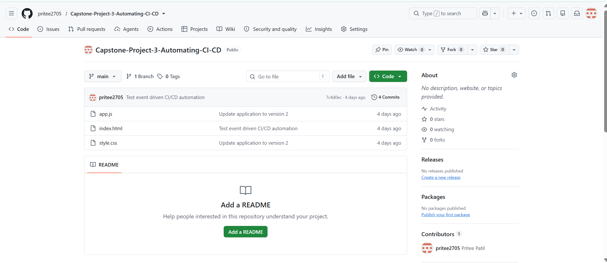

---

## Screenshot 2: GitHub Commit

Latest commit that triggered the CI/CD pipeline.

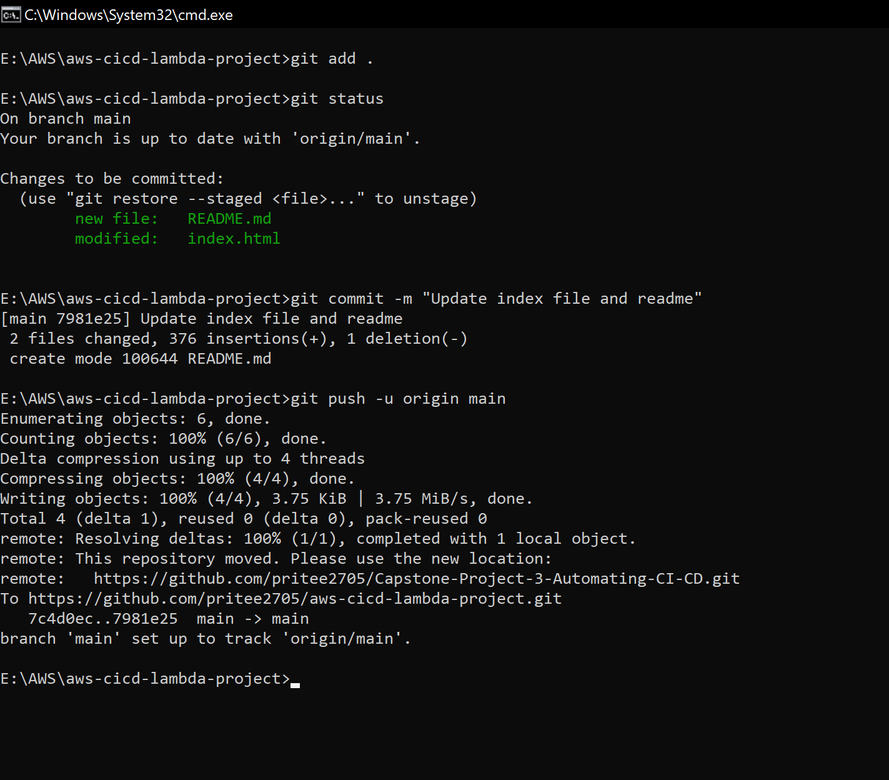

---

## Screenshot 3: CodePipeline Configuration

Configured pipeline `aws-lambda-cicd-demo-pipeline`.

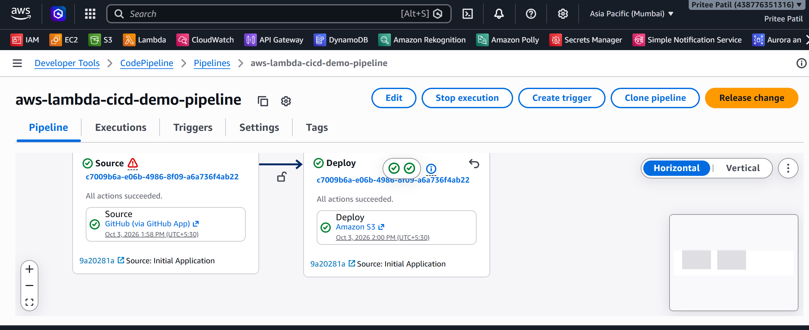

---

## Screenshot 4: Successful CodePipeline Execution

Successful Source and Deploy stages.

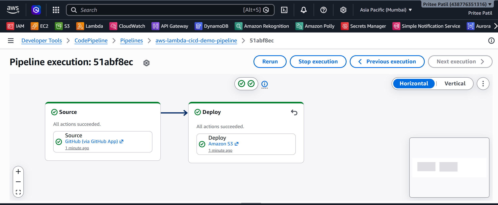

---

## Screenshot 5: S3 Deployment Bucket

Application files deployed to `aws-lambda-cicd-demo-project-2026`.

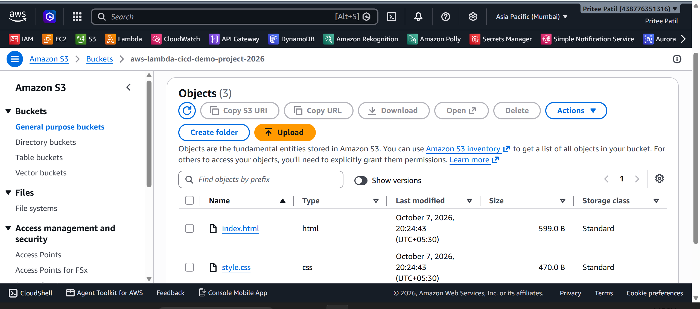

---

## Screenshot 6: Deployed Application

Final version of the application after deployment.

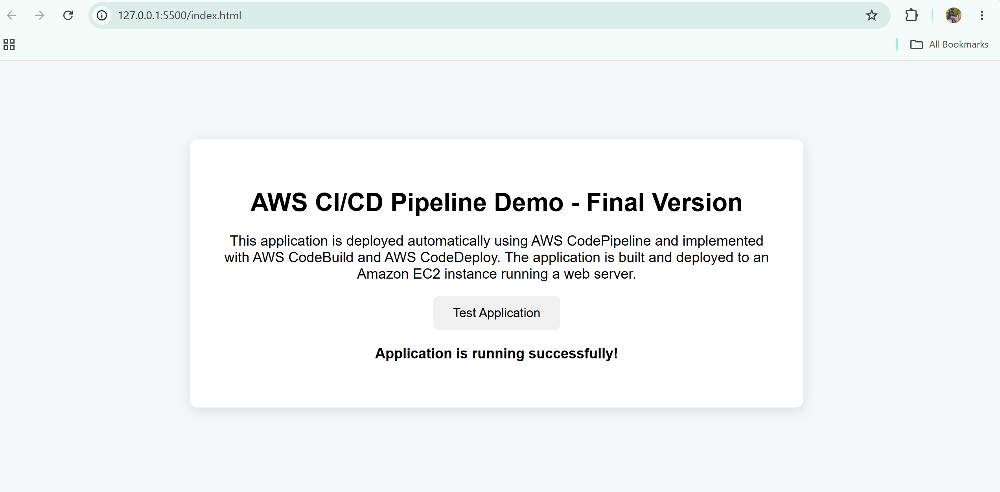

---

## Screenshot 7: Lambda Function

Lambda function `cicd-deployment-automation`.

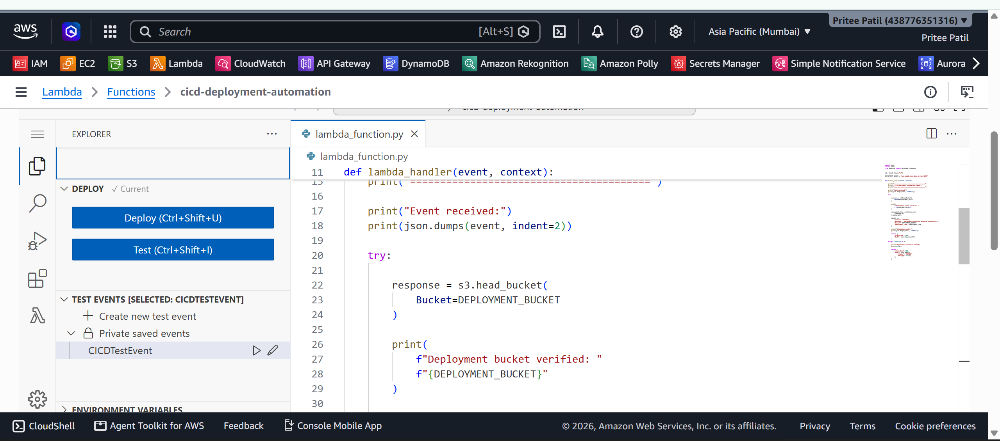

---

## Screenshot 8: EventBridge Custom Event Bus

Custom event bus `cicd-deployment-success-trigger`.

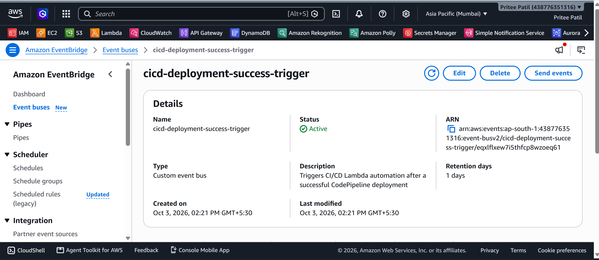

---

## Screenshot 9: EventBridge Event Source and Subscriber

CodePipeline event source and subscriber configured to invoke Lambda.

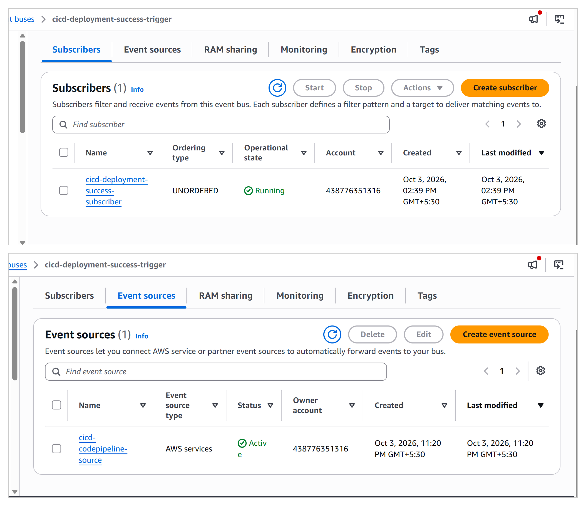

---

## Screenshot 10: CloudWatch Lambda Logs

Successful Lambda execution and deployment verification.

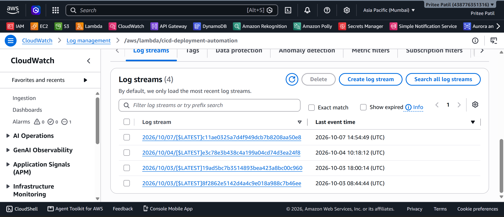

---

# 6. How to Run or Deploy the Project

## Prerequisites

- AWS account with access to CodePipeline, S3, Lambda, EventBridge, IAM, and CloudWatch
- GitHub account
- Git installed

## Clone the Repository

```bash
git clone https://github.com/pritee2705/aws-cicd-lambda-project.git
cd aws-cicd-lambda-project
```

## Run the Application Locally

Open `index.html` in a web browser. The application can be tested using the **Test Application** button.

## Deploy Using CI/CD

1. Make a change to the application source code, for example:

   ```html
   <h1>AWS CI/CD Pipeline Demo - Final Version</h1>
   ```

2. Commit and push the changes:

   ```bash
   git add .
   git commit -m "Update application"
   git push origin main
   ```

3. The configured CodePipeline automatically detects the change and starts the deployment.

```text
GitHub → CodePipeline → Amazon S3 → EventBridge → Lambda → CloudWatch
```

4. Monitor the run in CodePipeline, then check the Lambda logs in CloudWatch.

---

# 7. Key Learnings

- **CI/CD automation:** AWS CodePipeline can automatically deploy application changes from a source repository.
- **GitHub integration:** GitHub can be connected to AWS CodePipeline using AWS CodeConnections.
- **Amazon S3 deployment:** Static web application files can be automatically deployed and stored in Amazon S3.
- **AWS Lambda automation:** Lambda can execute serverless deployment automation in response to AWS events.
- **Event-driven architecture:** A successful CodePipeline execution can automatically trigger the next deployment automation step.
- **Amazon EventBridge:** EventBridge can receive AWS service events, filter relevant events, and route them to downstream services.
- **IAM:** IAM roles and policies control access between AWS services.
- **CloudWatch monitoring:** CloudWatch Logs help monitor Lambda executions and troubleshoot serverless workflows.
- **Serverless architecture:** AWS managed services can be combined to build an automated CI/CD solution without managing traditional servers.